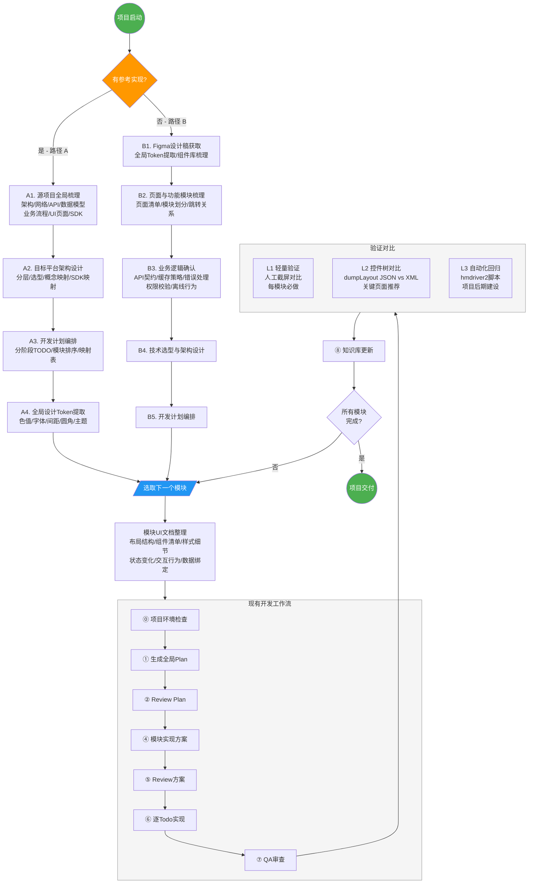
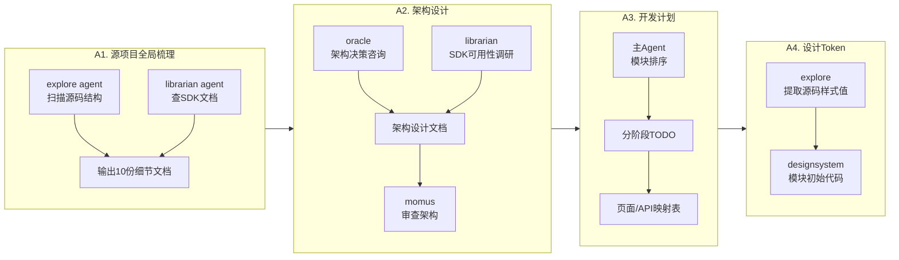
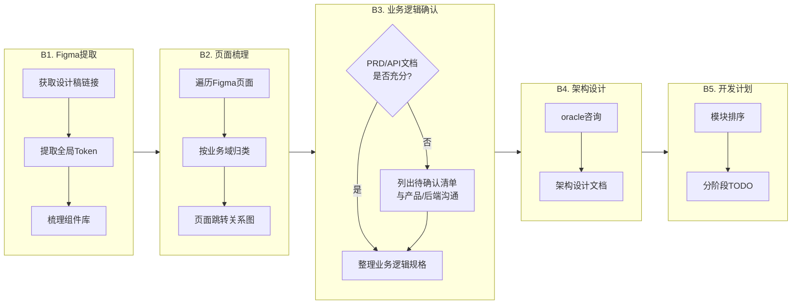
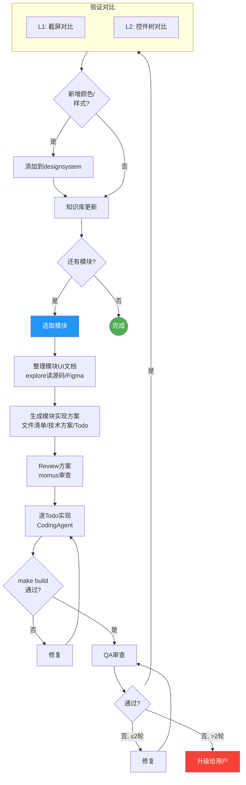

# 项目启动工作流（Pre-Implementation Phase）

> 定位：现有 `AI辅助开发工作流.md` 的前置阶段。
> 本文档覆盖"从零到可执行 Plan"的全过程，完成后衔接到现有工作流的 ⓪ 项目环境检查。

## 一、适用场景

项目启动时，根据信息来源不同，分为两条路径：

| 路径 | 触发条件 | 核心输入 | 核心产出 |
|------|---------|---------|---------|
| 路径 A：有参考实现 | 存在已成型的其他平台版本（如 Android → Harmony） | 源码 | 项目细节文档 + 架构设计 + 开发计划 |
| 路径 B：无参考实现 | 从设计稿起步（如 Figma） | 设计稿 + 产品需求 | UI 实现文档 + 功能规格 + 架构设计 + 开发计划 |

两条路径最终汇聚到同一个执行入口：**模块级实现方案编写 → 进入现有开发工作流**。

---

## 二、路径 A：有参考实现（源码复刻）

### A1. 源项目全局梳理

**目标**：建立对源项目的完整认知，输出结构化的项目细节文档。

**产出文档**（以 Android → Harmony 为例，参考 `Docs/android/` 目录）：

| 文档 | 内容 | 对应示例 |
|------|------|---------|
| 架构总览 | 项目结构、分层、模块划分、依赖关系 | `01_architecture_overview.md` |
| 网络层 | HTTP 封装、拦截器、错误处理、重试策略 | `02_network_layer.md` |
| API 接口 | 接口清单、请求/响应格式、鉴权方式 | `03_api_interfaces.md` |
| 数据模型 | 实体类、DTO、枚举、类型映射 | `04_data_models.md` |
| 数据库 | 表结构、索引、迁移策略 | `05_database_schema.md` |
| 业务流程 | 核心业务逻辑（登录流程、支付流程、播放流程等） | `06_business_flows.md` |
| UI 页面 | 页面清单、页面间跳转关系、Activity/Fragment 映射 | `07_ui_pages.md` |
| 三方 SDK | SDK 清单、版本、用途、鸿蒙替代方案 | `08_third_party_sdk.md` |
| 配置与常量 | 硬编码值、配置项、Feature Flag | `09_config_and_constants.md` |
| 安全与加密 | Token 管理、加密方式、签名校验 | `10_security_and_encryption.md` |

**执行方式**：
- Agent 角色：explore（扫描源码结构）+ librarian（查三方 SDK 文档）并行
- 产出审查：oracle 或 momus 审查文档完整性

### A2. 目标平台架构设计

**目标**：基于源项目梳理结果，设计目标平台的架构方案。

**产出文档**（参考 `Docs/鸿蒙版架构设计.md`）：
- 架构总览（分层、目录结构、依赖规则）
- 关键架构决策（技术选型理由）
- 功能范围（包含/排除）
- 概念映射表（源平台 → 目标平台）
- 三方 SDK 映射表（源 SDK → 目标 SDK + ohpm 包名）
- 权益/支付等核心业务逻辑的 1:1 还原规则

**执行方式**：
- Agent 角色：oracle（架构决策咨询）+ librarian（目标平台 SDK 可用性调研）
- 产出审查：momus 审查架构合理性

### A3. 开发计划编排

**目标**：将功能拆分为可执行的阶段和模块，确定实现顺序。

**产出文档**（参考 `Docs/鸿蒙版开发计划.md`）：
- 分阶段 TODO 列表（Phase 0 基础设施 → Phase N 打磨上线）
- 模块依赖关系与执行顺序
- 源平台页面 → 目标平台页面映射表
- 源平台 API → 目标平台 Repository 映射表
- SDK 可用性确认清单
- 待确认/阻塞事项

**排序原则**：
1. 基础设施层（网络/存储/路由/设计系统）必须最先完成
2. 被依赖的模块先于依赖方
3. 核心 MVP 功能优先（用户可以完成最小闭环）
4. 商业化和高级功能靠后

### A4. 全局设计 Token 提取

**目标**：从源项目中提取全局设计规范，建立目标平台的设计系统基础。

**范围**：
- 色值体系（主色/辅色/背景色/文字色/分割线色/状态色）
- 字体规范（字号/字重/行高）
- 间距规范（页面边距/组件间距/内边距）
- 圆角规范
- 主题配置（深色模式映射）

**产出**：目标平台的 `designsystem` 模块初始代码（常量定义 + 通用 @Styles）

**注意**：
- 通用组件在实现具体模块时按需提取，不在此阶段预建
- 页面级颜色在实现时从源码中检查并添加到设计系统

---

## 三、路径 B：无参考实现（设计稿起步）

### B1. 设计稿获取与全局 Token 提取

**目标**：从 Figma 设计稿中提取全局设计规范。

**操作步骤**：
1. 获取 Figma 设计稿链接
2. 提取全局设计 Token（同 A4 范围）
3. 梳理组件库（Figma 中的 Component Set → 目标平台通用组件清单）

**产出**：
- 设计 Token 文档（色值/字体/间距/圆角）
- 组件清单（名称 + 用途 + 出现页面）
- `designsystem` 模块初始代码

### B2. 页面与功能模块梳理

**目标**：从设计稿反推功能模块划分。

**操作步骤**：
1. 遍历 Figma 页面/Frame，建立页面清单
2. 按业务域归类页面 → 功能模块
3. 梳理页面间跳转关系（导航图）

**产出**：
- 页面清单（页面名 + 所属模块 + 页面描述）
- 模块划分（模块名 + 包含页面 + 模块职责）
- 页面跳转关系图

### B3. 业务逻辑确认（路径 B 独有）

**目标**：补全设计稿无法提供的业务逻辑信息。

**Figma 能提供的**：UI 结构、视觉细节、页面流转
**Figma 不能提供的**：
- 数据来源与 API 契约
- 列表分页/缓存/刷新策略
- 错误状态处理逻辑
- 权限/权益校验规则
- 离线行为
- 埋点需求

**确认方式**：
- 产品需求文档（PRD）
- API 文档
- 与产品/后端直接沟通
- 如以上都缺失 → 列出待确认清单，阻塞对应模块的实现方案编写

**产出**：
- 业务逻辑规格文档（按模块组织）
- 待确认事项清单（标注阻塞的模块和阶段）

### B4. 技术选型与架构设计

**目标**：确定技术栈和架构方案。

**决策维度**：
- 目标平台与 API 版本
- 开发语言与框架
- 状态管理方案
- 网络层方案
- 数据持久化方案
- 路由/导航方案
- 三方 SDK 选型

**产出**：架构设计文档（同 A2 产出格式）

### B5. 开发计划编排

同 A3，但模块划分基于 B2 的梳理结果而非源码映射。

---

## 四、模块实现前的 UI 文档整理（两条路径共有）

> 这是进入现有开发工作流（步骤 ④ 生成模块实现方案）之前的必要动作。

### 触发时机

每个功能模块开始实现前，先整理该模块的 UI 实现文档。

### 4.1 路径 A 的 UI 文档整理

**信息来源**：源项目的 XML 布局 / Compose 声明式布局 + 对应的 Activity/Fragment/ViewModel 代码

**整理内容**：

| 维度 | 具体内容 |
|------|---------|
| 布局结构 | 页面层级、组件嵌套关系、列表类型（线性/网格/瀑布流） |
| 组件清单 | 页面使用的所有 UI 组件（标准组件 + 自定义组件） |
| 样式细节 | 字体大小/颜色、背景色、间距、圆角、阴影（从源码中提取具体值） |
| 状态变化 | 文本内容变化条件、颜色切换条件、可见性切换条件、按钮启用/禁用条件 |
| 交互行为 | 点击事件、长按事件、滑动行为、手势、动画 |
| 数据绑定 | UI 元素与数据字段的对应关系、列表项的数据模型 |
| 空状态/错误状态 | 无数据时的展示、加载失败时的展示、网络异常时的展示 |

**执行方式**：
- explore agent 读取源项目的布局文件 + 对应逻辑代码
- 输出结构化的 UI 实现文档，存放在 `.ai/plans/{module}-ui.md`

### 4.2 路径 B 的 UI 文档整理

**信息来源**：Figma 设计稿中对应模块的页面

**整理内容**：

| 维度 | 具体内容 |
|------|---------|
| 布局结构 | 从 Figma Frame 层级推导组件嵌套关系 |
| 组件清单 | Figma 中使用的 Component Instance → 映射到目标平台组件 |
| 样式细节 | 从 Figma 节点属性提取（字体/颜色/间距/圆角/阴影） |
| 状态变化 | 从 Figma Variants 提取（不同状态的视觉差异） |
| 交互行为 | 从 Figma Prototype 连线提取（跳转/动画） |
| 响应式 | 从 Figma Auto Layout / Constraints 提取适配规则 |

**注意**：Figma 无法提供的动态逻辑（如"余额不足时按钮变灰"的具体条件），需要从 B3 的业务逻辑文档中补充。

### 4.3 新增颜色/样式的处理

实现模块时，如果遇到设计系统中尚未定义的颜色或样式：
1. 从源码/Figma 中确认具体值
2. 添加到 `designsystem` 模块的常量定义中
3. 在当前模块中引用，不使用硬编码值

### 4.4 通用组件的提取

实现模块时，如果发现某个 UI 模式在多个页面重复出现：
1. 先在当前模块内实现
2. 确认复用需求后，提取到 `commons/components`
3. 不预建通用组件，按需提取

---

## 五、验证对比环节

### 触发时机

每个功能模块实现完成后（现有工作流步骤 ⑦ QA 之后），增加一个视觉/行为对比验证步骤。

### 5.1 验证工具链

#### Android（参考实现端）

| 能力 | 工具/命令 |
|------|----------|
| 截屏 | `adb shell screencap -p /sdcard/screen.png && adb pull /sdcard/screen.png` |
| 控件树 | `adb shell uiautomator dump && adb pull /sdcard/window_dump.xml` |
| UI 自动化 | UIAutomator2 / Espresso |

#### HarmonyOS（目标平台）

| 能力 | 工具/命令 |
|------|----------|
| 截屏 | `hdc shell snapshot_display -f /data/local/tmp/screen.jpeg && hdc file recv /data/local/tmp/screen.jpeg ./` |
| 控件树 | `hdc shell uitest dumpLayout`（输出 JSON） |
| UI 自动化 | arkxtest（官方 UiTest）/ hmdriver2（社区 Python 框架，无侵入式） |
| 稳定性测试 | Wukong（随机事件注入） |
| UI 输入模拟 | `hdc shell uitest uiInput`（tap/swipe/keyEvent/text） |

#### hmdriver2 简介

社区驱动的 Python UI 自动化框架（425+ stars，MIT），API 风格对齐 Android 的 uiautomator2：
- 无侵入式（无需在设备端安装额外 app）
- 支持元素定位（by text/id/type）、截屏、手势操作、应用管理
- `pip install hmdriver2`

### 5.2 验证策略（分层）

| 层级 | 方式 | 时机 | 成本 |
|------|------|------|------|
| L1 轻量验证 | 人工截屏对比关键页面 | 每个模块完成后（必做） | 低 |
| L2 控件树对比 | `uitest dumpLayout` 导出 JSON，与 Android `uiautomator dump` XML 做结构对比 | 关键页面（推荐） | 中 |
| L3 自动化回归 | hmdriver2 脚本自动走关键路径，每页截屏 + dump，与基线对比 | 项目后期统一建设 | 高 |

**L1 是底线**，每个模块必须做。L2 和 L3 根据项目阶段和资源决定。

### 5.3 跨平台对比的注意事项

- 状态栏、导航栏、字体渲染在不同系统上天然有差异，对比时需裁剪到内容区域
- 截屏对比建议设定容差阈值（如 5% 像素差异以内视为通过）
- 控件树对比比截屏更有价值，能验证逻辑层面的正确性（文本内容、可见性、层级结构）

---

## 六、与现有工作流的衔接

```
本文档流程                              现有工作流
─────────────                          ──────────
路径 A / 路径 B                         
    │                                  
    ▼                                  
项目细节文档 + 架构设计 + 开发计划        
    │                                  
    ▼                                  
全局设计 Token 提取                     
    │                                  
    ▼                                  
选取下一个模块                          
    │                                  
    ▼                                  
模块 UI 文档整理 ──────────────────────→ ⓪ 项目环境检查
                                        │
                                        ▼
                                       ① 生成全局 Plan
                                        │
                                        ▼
                                       ② Review Plan
                                        │
                                        ▼
                                       ④ 模块实现方案
                                        │
                                        ▼
                                       ⑤ Review 方案
                                        │
                                        ▼
                                       ⑥ 逐 Todo 实现
                                        │
                                        ▼
                                       ⑦ QA 审查
                                        │
                                        ▼
                                       验证对比（本文档 §5）
                                        │
                                        ▼
                                       ⑧ 知识库更新
                                        │
                                        ▼
                                       ⑨ 回到"选取下一个模块"
```

---

## 七、Agent 角色分配总览

| 阶段 | 主要 Agent | 说明 |
|------|-----------|------|
| 源码梳理（A1） | explore + librarian（并行） | explore 扫源码，librarian 查 SDK 文档 |
| 架构设计（A2/B4） | oracle | 多方案权衡 |
| 架构审查 | momus | 审查架构合理性 |
| 开发计划（A3/B5） | 主 Agent | 编排模块顺序 |
| 设计 Token 提取（A4/B1） | explore（源码）/ Figma 工具（设计稿） | 提取全局样式 |
| Figma 页面梳理（B2） | explore + 主 Agent | 页面归类 |
| 业务逻辑确认（B3） | 主 Agent → 用户 | 需人工确认 |
| 模块 UI 文档（§4） | explore（读源码/Figma）+ writing（输出） | 串联执行 |
| 模块实现 | visual-engineering / deep | 按模块性质选 category |
| 验证对比（§5） | playwright / dev-browser / 人工 | 按验证层级选择 |

---

## 八、可视化流程图

### 8.1 全局流程总览



### 8.2 路径 A 详细流程（有参考实现）



### 8.3 路径 B 详细流程（无参考实现）



### 8.4 模块实现循环（单模块生命周期）


