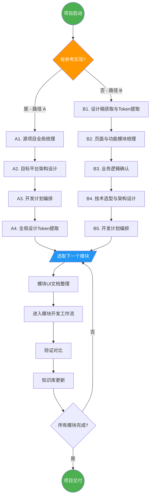
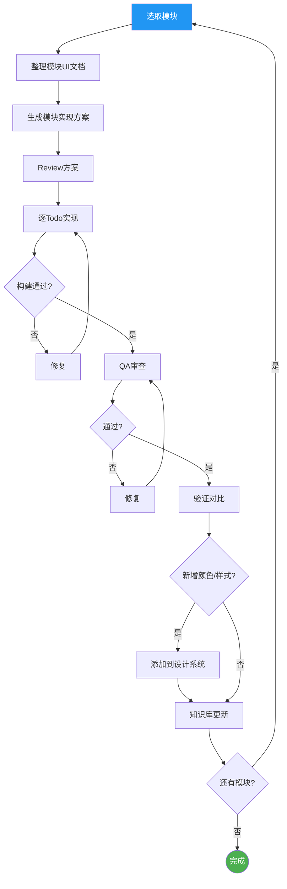

# 项目启动工作流

> 覆盖"从零到可执行开发计划"的全过程。
> 完成后衔接到 [模块开发工作流](模块开发工作流.md) 进入逐模块实现循环。

---

## 一、适用场景

根据信息来源不同，分为两条路径：

| 路径 | 触发条件 | 核心输入 | 核心产出 |
|------|---------|---------|---------|
| 路径 A：有参考实现 | 存在已成型的其他平台版本 | 源码 | 项目细节文档 + 架构设计 + 开发计划 |
| 路径 B：无参考实现 | 从设计稿起步 | 设计稿 + 产品需求 | UI 实现文档 + 功能规格 + 架构设计 + 开发计划 |

两条路径最终汇聚到同一个执行入口：**模块级实现方案编写 → 进入模块开发工作流**。

---

## 二、路径 A：有参考实现（源码复刻）

### A1. 源项目全局梳理

**目标**：建立对源项目的完整认知，输出结构化的项目细节文档。

**产出**：按 [源码梳理文档模板](../templates/源码梳理文档模板.md) 输出以下文档，存放在 `references/{platform}/`：

| 文档 | 内容 |
|------|------|
| 架构总览 | 项目结构、分层、模块划分、依赖关系 |
| 网络层 | HTTP 封装、拦截器、错误处理、重试策略 |
| API 接口 | 接口清单、请求/响应格式、鉴权方式 |
| 数据模型 | 实体类、DTO、枚举、类型映射 |
| 数据库 | 表结构、索引、迁移策略 |
| 业务流程 | 核心业务逻辑（登录、支付、播放等关键流程） |
| UI 页面 | 页面清单、页面间跳转关系、页面与代码映射 |
| 三方 SDK | SDK 清单、版本、用途、目标平台替代方案 |
| 配置与常量 | 硬编码值、配置项、Feature Flag |
| 安全与加密 | Token 管理、加密方式、签名校验 |

**Agent 分工**：
- explore（并行）：扫描源码结构、模块划分、调用关系
- librarian（并行）：查三方 SDK 文档、目标平台替代方案

### A2. 目标平台架构设计

**目标**：基于源项目梳理结果，设计目标平台的架构方案。

**产出**：按 [架构设计文档模板](../templates/架构设计文档模板.md) 输出，存放在 `chapters/00-项目搭建/技术选型与架构设计.md`：
- 架构总览（分层、目录结构、依赖规则）
- 关键架构决策（技术选型理由）
- 功能范围（包含/排除）
- 概念映射表（源平台 → 目标平台）
- 三方 SDK 映射表
- 核心业务逻辑的 1:1 还原规则

**Agent 分工**：
- oracle：架构决策咨询
- librarian（并行）：目标平台 SDK 可用性调研
- momus：审查架构合理性

### A3. 开发计划编排

**目标**：将功能拆分为可执行的阶段和模块，确定实现顺序。

**产出**：存放在 `chapters/00-项目搭建/开发计划.md`：
- 分阶段 TODO 列表（Phase 0 基础设施 → Phase N 打磨上线）
- 模块依赖关系与执行顺序
- 源平台页面 → 目标平台页面映射表
- 源平台 API → 目标平台 Repository 映射表
- SDK 可用性确认清单
- 待确认/阻塞事项

**排序原则**：
1. 基础设施层（网络/存储/路由/设计系统）和 **验证基建（自动化截图、对比脚本封装 `tests/scripts` 等）** 必须在 Phase 0 最先完成，且验证工具链需通过连通性测试。
2. 被依赖的模块先于依赖方
3. 核心 MVP 功能优先（用户可以完成最小闭环）
4. 商业化和高级功能靠后

### A4. 全局设计 Token 提取

**目标**：从源项目中提取全局设计规范，建立目标平台的设计系统基础。

**范围**：
- 色值体系（主色/辅色/背景色/文字色/分割线色/状态色）
- 字体规范（字号/字重/行高）
- 间距规范（页面边距/组件间距/内边距）
- 圆角规范
- 主题配置（深色模式映射）

**产出**：目标平台的设计系统模块初始代码（常量定义 + 通用样式）

**注意**：
- 通用组件在实现具体模块时按需提取，不在此阶段预建
- 页面级颜色在实现时从源码中检查并添加到设计系统

---

## 三、路径 B：无参考实现（设计稿起步）

### B1. 设计稿获取与全局 Token 提取

**目标**：从设计稿中提取全局设计规范。

**操作步骤**：
1. 获取设计稿链接（如 Figma）
2. 提取全局设计 Token（同 A4 范围）
3. 梳理组件库（设计稿中的 Component Set → 目标平台通用组件清单）

**产出**：
- 设计 Token 文档（色值/字体/间距/圆角）
- 组件清单（名称 + 用途 + 出现页面）
- 设计系统模块初始代码

### B2. 页面与功能模块梳理

**目标**：从设计稿反推功能模块划分。

**操作步骤**：
1. 遍历设计稿页面/Frame，建立页面清单
2. 按业务域归类页面 → 功能模块
3. 梳理页面间跳转关系（导航图）

**产出**：
- 页面清单（页面名 + 所属模块 + 页面描述）
- 模块划分（模块名 + 包含页面 + 模块职责）
- 页面跳转关系图

### B3. 业务逻辑确认（路径 B 独有）

**目标**：补全设计稿无法提供的业务逻辑信息。

**设计稿能提供的**：UI 结构、视觉细节、页面流转
**设计稿不能提供的**：
- 数据来源与 API 契约
- 列表分页/缓存/刷新策略
- 错误状态处理逻辑
- 权限/权益校验规则
- 离线行为
- 埋点需求

**确认方式**：
- 产品需求文档（PRD）
- API 文档
- 与产品/后端直接沟通
- 如以上都缺失 → 列出待确认清单，阻塞对应模块的实现方案编写

**产出**：
- 业务逻辑规格文档（按模块组织）
- 待确认事项清单（标注阻塞的模块和阶段）

### B4. 技术选型与架构设计

同 A2，但输入来源是 B2 的模块划分 + B3 的业务逻辑，而非源码梳理。

### B5. 开发计划编排

同 A3，但模块划分基于 B2 的梳理结果而非源码映射。

---

## 四、模块实现前的 UI 文档整理（两条路径共有）

> 这是进入 [模块开发工作流](模块开发工作流.md) 之前的必要动作。
> 每个功能模块开始实现前，先整理该模块的 UI 实现文档。

### 4.1 路径 A 的 UI 文档整理

**信息来源**：源项目的布局文件 + 对应的页面/逻辑代码

**产出**：按 [模块UI实现文档模板](../templates/模块UI实现文档模板.md) 输出，存放在 `chapters/{NN}-{模块名}/ui-plan.md`

**整理内容**：

| 维度 | 具体内容 |
|------|---------|
| 布局结构 | 页面层级、组件嵌套关系、列表类型 |
| 组件清单 | 页面使用的所有 UI 组件（标准 + 自定义） |
| 样式细节 | 字体大小/颜色、背景色、间距、圆角、阴影 |
| 状态变化 | 文本内容变化条件、颜色切换条件、可见性切换条件、按钮启用/禁用条件 |
| 交互行为 | 点击事件、长按事件、滑动行为、手势、动画 |
| 数据绑定 | UI 元素与数据字段的对应关系、列表项的数据模型 |
| 空状态/错误状态 | 无数据时的展示、加载失败时的展示、网络异常时的展示 |

### 4.2 路径 B 的 UI 文档整理

**信息来源**：设计稿中对应模块的页面

**整理内容**：

| 维度 | 具体内容 |
|------|---------|
| 布局结构 | 从设计稿 Frame 层级推导组件嵌套关系 |
| 组件清单 | 设计稿中使用的 Component Instance → 映射到目标平台组件 |
| 样式细节 | 从设计稿节点属性提取（字体/颜色/间距/圆角/阴影） |
| 状态变化 | 从设计稿 Variants 提取（不同状态的视觉差异） |
| 交互行为 | 从设计稿 Prototype 连线提取（跳转/动画） |
| 响应式 | 从设计稿 Auto Layout / Constraints 提取适配规则 |

**注意**：设计稿无法提供的动态逻辑，需要从 B3 的业务逻辑文档中补充。

### 4.3 新增颜色/样式的处理

实现模块时，如果遇到设计系统中尚未定义的颜色或样式：
1. 从源码/设计稿中确认具体值
2. 添加到设计系统模块的常量定义中
3. 在当前模块中引用，不使用硬编码值

### 4.4 通用组件的提取

实现模块时，如果发现某个 UI 模式在多个页面重复出现：
1. 先在当前模块内实现
2. 确认复用需求后，提取到公共组件库
3. 不预建通用组件，按需提取

---

## 五、跨平台验证基建要求 (v2.0 强制规范)

### 5.1 验证工具能力映射 (Capability Matrix)

跨平台开发的核心痛点在于底层命令不统一。在项目启动时，**必须**在架构设计文档中敲定针对当前目标平台的具体映射工具。各层级验证要求如下：

| 验证层级 | 核心能力诉求 | Android (参考) | iOS (参考) | HarmonyOS (参考) | Web/小程序 (参考) |
|----------|-------------|---------------|-----------|------------------|-------------------|
| **L1 轻量验证** | 屏幕像素级截图 | `adb shell screencap` | `xcrun simctl io screenshot` | `hdc shell snapshot_display` | Playwright/Puppeteer |
| **L2 结构验证** | 导出控件树结构 | `uiautomator dump` | `XCTest` 树获取 | `uitest dumpLayout` | `minium` 结构快照 |
| **L3 自动化回归** | 设备端 UI 驱动脚本 | Appium / uiautomator2 | XCUITest / wda | arkxtest / hmdriver2 | Cypress / Minium |

### 5.2 统一命令封装原则 (Command Wrapper)

为了消除 AI 在后续模块开发时的“命令幻觉”和高昂的探索成本，**禁止让 Agent 直接执行 `adb` 或 `hdc` 等裸命令**。
必须在项目 `Phase 0 基础设施` 阶段建立一层壳，例如在项目根目录提供一个标准的 `Makefile` 或 `scripts/` 工具集：
- `make verify-l1`：一键触发 L1 截图保存到指定的基建目录。
- `make verify-l2`：一键抓取首屏结构树。
- `make compare`：调用底层轻量级对比工具（如 `pixelmatch` 或 JSON 属性过滤比对）。

### 5.3 验证对比的触发时机与注意事项

- **触发时机**：每个子功能模块的 Todo 实现完成后，QA 此环节必须调用上述 `make verify-xx` 命令，并截取回传图纸与最初的模块 UI 文档或设计稿打横对比。
- **跨平台跨端对比难点**：
  - 各端原生的状态栏、导航栏、字体渲染天然有差异，务必把对比限定在业务安全区域（裁剪截取）。
  - L2 控件树对比比截屏更有价值（抗噪声强），应优先比对界面层级关系、核心 `ComponentType` ，动态文字应采取模糊匹配。

---

## 六、与模块开发工作流的衔接

```
本工作流                                模块开发工作流
─────────                              ──────────
路径 A / 路径 B
    │
    ▼
项目细节文档 + 架构设计 + 开发计划
    │
    ▼
全局设计 Token 提取
    │
    ▼
选取下一个模块
    │
    ▼
模块 UI 文档整理 ──────────────────────→ 模块开发工作流
                                        │
                                        ▼
                                       ① 生成模块实现方案
                                        │
                                        ▼
                                       ② Review 方案
                                        │
                                        ▼
                                       ③ 逐 Todo 实现
                                        │
                                        ▼
                                       ④ QA 审查
                                        │
                                        ▼
                                       验证对比（本文档 §5）
                                        │
                                        ▼
                                       ⑤ 知识库更新
                                        │
                                        ▼
                                       回到"选取下一个模块"
```

---

## 七、Agent 角色分配总览

| 阶段 | 主要 Agent | 说明 |
|------|-----------|------|
| 源码梳理（A1） | explore + librarian（并行） | explore 扫源码，librarian 查 SDK 文档 |
| 架构设计（A2/B4） | oracle | 多方案权衡 |
| 架构审查 | momus | 审查架构合理性 |
| 开发计划（A3/B5） | 主 Agent | 编排模块顺序 |
| 设计 Token 提取（A4/B1） | explore（源码）/ 设计稿工具 | 提取全局样式 |
| 页面梳理（B2） | explore + 主 Agent | 页面归类 |
| 业务逻辑确认（B3） | 主 Agent → 用户 | 需人工确认 |
| 模块 UI 文档（§4） | explore + writing | 串联执行 |
| 模块实现 | 按模块性质选 category | visual-engineering / deep 等 |
| 验证对比（§5） | playwright / dev-browser / 人工 | 按验证层级选择 |

---

## 八、可视化流程图

### 8.1 全局流程总览



### 8.2 单模块生命周期


